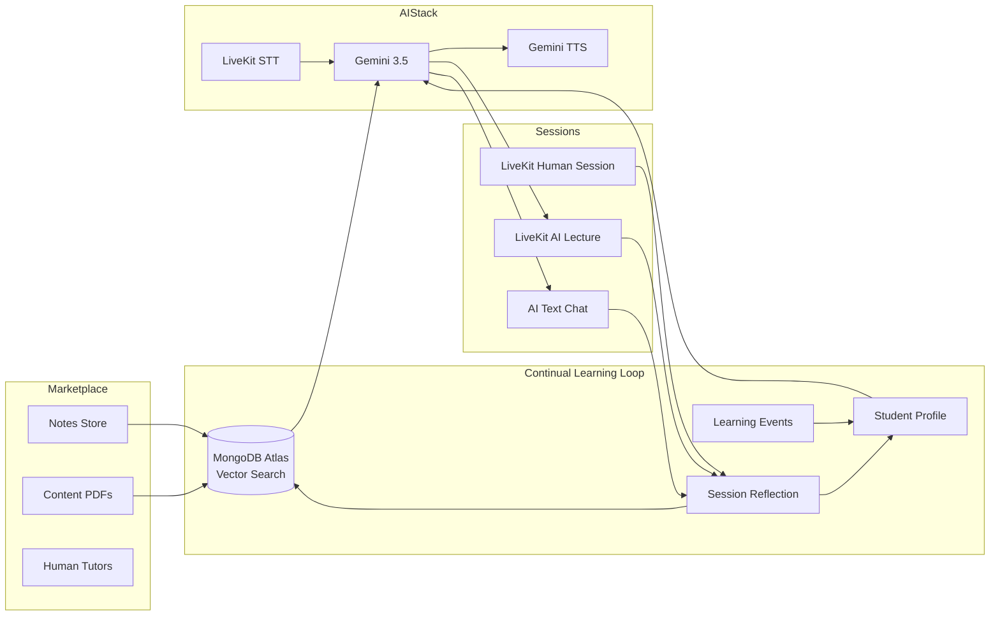

# TutorLoop

**Human tutoring that teaches the AI tutor to get better — without fine-tuning model weights.**

Built for the [**AI Engineer World's Fair Hackathon 2026**](https://cerebralvalley.ai/e/aiewf-hackathon-2026/details) (hosted by [Cerebral Valley](https://cerebralvalley.ai) + Shack15, in partnership with the [AI Engineer World's Fair](https://www.ai.engineer/worldsfair)).

> The hackathon theme is **recursive self-improvement**: systems that learn from their own outputs, iterate continuously, and become more capable over time. TutorLoop applies that idea to education — every human tutoring session and every AI tutoring session makes the *next* tutoring session better.

---

## The idea

Students hire tutors, buy notes and textbooks, and join live AI lectures. After each session, TutorLoop **reflects** on what worked, stores that memory in MongoDB, and **retrieves** it the next time the student asks for help.

The AI tutor does not retrain Gemini. It improves through a **modular memory loop**:

1. **Observe** — transcripts from human tutors and AI lectures
2. **Reflect** — Gemini summarizes weaknesses, successful teaching methods, and future instructions
3. **Remember** — embeddings + structured profiles in MongoDB Atlas
4. **Retrieve** — per-collection vector search grounds the next answer in past sessions and textbooks
5. **Measure** — micro-quizzes produce mastery deltas; thumbs-up/down feedback boosts helpful memories in retrieval ranking
6. **Repeat** — recommendations and tutoring style adapt as the profile changes

This is **continual learning via memory and retrieval**, aligned with the World's Fair tracks on [Memory & Continual Learning](https://www.ai.engineer/worldsfair), RAG, Voice & Realtime AI, and Evals.

---

## Why it matters

| Problem | TutorLoop approach |
|---|---|
| AI tutors forget every session | Persistent `student_learning_profiles`, `ai_reflections`, and embedded conversations |
| Generic tutoring ignores the student | Weak topics, mastered topics, and prior teaching methods feed every response |
| RAG dumps irrelevant context | Per-collection MongoDB vector indexes + optional source picker to narrow lectures to specific books |
| No proof the system is improving | Mastery checks (quiz → grade → delta), `learning_events`, and optional W&B Weave evals |

---

## Architecture



**Voice AI lecture pipeline:** student speech → LiveKit Inference STT → **Gemini 3.5** → Gemini TTS → tutor voice. Same model family as text chat.

**RAG:** MongoDB Atlas Vector Search across `notes`, `books`, `book_chunks`, `ai_reflections`, `transcripts`, and `ai_conversations` — each with its **own** vector index and tailored filter fields.

---

## Partner stack

| Technology | Role in TutorLoop |
|---|---|
| [**MongoDB Atlas**](https://www.mongodb.com/docs/atlas/) | Primary database + [Vector Search RAG](https://www.mongodb.com/docs/atlas/atlas-vector-search/vector-search-overview/) |
| [**Gemini**](https://ai.google.dev/) | Tutor chat, reflections, quiz generation/grading, embeddings, TTS |
| [**LiveKit**](https://docs.livekit.io/) | Real-time voice/video AI lectures + human classroom tokens |
| [**Weights & Biases Weave**](https://wandb.ai/site/weave) | Optional tracing and continual-learning evals |
| **FastAPI** | API + static frontend |
| **DigitalOcean** | Docker-ready deployment (`.do/app.yaml`) |

---

## 3-minute demo script (for judges)

1. **Search** — type `biology cell division` in the store → semantic results from diverse notes.
2. **Buy & library** — purchase a note → find it under **My Library**.
3. **Book a tutor** — open a tutor's calendar → book an available slot.
4. **AI lecture** — AI Tutor tab → enter `Calculus: derivatives` → optionally pick a content-folder book → **Start AI lecture** → speak to interject (LiveKit + Gemini 3.5).
5. **Reflect** — after a session, run reflection → profile gains weak topics and teaching instructions.
6. **Ask again** — same topic in AI chat → answer retrieves past reflections + books.
7. **Mastery check** — take a micro-quiz → see mastery delta (`prior% → new%`) and updated weak/mastered topics.
8. **Feedback** — thumbs up on an AI answer → that memory gets a positive retrieval reward.

Demo login: `student@tutorloop.demo` / `password123`

---

## Quickstart

```bash
python -m venv .venv
.venv\Scripts\activate          # Windows
# source .venv/bin/activate     # macOS/Linux
pip install -r backend/requirements.txt
copy .env.example .env          # fill in keys
python run.py
```

Open **http://127.0.0.1:8080**.

One command starts:
- FastAPI web app + frontend
- LiveKit AI lecture agent (`tutorloop-ai-tutor`)

Optional first-time agent setup:

```bash
python -m livekit.agents download-files
```

The app runs without cloud credentials — missing MongoDB, Gemini, or LiveKit keys fall back to mock mode so the demo flow still works.

---

## Environment

```bash
# MongoDB Atlas
MONGODB_URI=
MONGODB_DB_NAME=tutorloop

# Gemini — text chat, reflections, voice LLM, embeddings, TTS
GEMINI_API_KEY=
GEMINI_MODEL=gemini-3.5-flash
GEMINI_EMBEDDING_MODEL=gemini-embedding-001
GEMINI_TTS_MODEL=gemini-2.5-flash-preview-tts
GEMINI_TTS_VOICE=Zephyr

# LiveKit — voice/video lectures (STT billed via LiveKit Inference)
LIVEKIT_URL=
LIVEKIT_API_KEY=
LIVEKIT_API_SECRET=
TUTOR_STT_MODEL=deepgram/nova-3
RUN_LIVEKIT_AGENT=true

# W&B Weave — optional observability + evals
WEAVE_ENABLED=false
WEAVE_PROJECT=tutorloop
WANDB_API_KEY=
```

---

## Key API endpoints

| Endpoint | Purpose |
|---|---|
| `GET /search`, `/notes/search`, `/books/search`, `/tutors/search` | Semantic marketplace search |
| `POST /ai/lecture/start` | Start LiveKit AI lecture with RAG context |
| `POST /ai/chat` | Text AI tutor (RAG + profile) |
| `POST /ai/quiz/start`, `/ai/quiz/grade` | Mastery checks with measurable deltas |
| `POST /ai/conversations/{id}/feedback` | Explicit feedback → retrieval reward |
| `POST /sessions/{id}/reflect` | Reflect on human tutoring session |
| `POST /ai/conversations/{id}/reflect` | Reflect on AI tutor session |
| `GET /students/{id}/recommendations` | Profile-driven recommendations |
| `GET /students/{id}/library` | Purchased notes and books |
| `GET /tutors/{id}/availability/calendar` | Tutor booking calendar |

Full list: run the app and open `/docs`.

---

## MongoDB Atlas setup

1. Create a cluster and database named `tutorloop`.
2. Set `MONGODB_URI` in `.env`.
3. Import demo data:

```bash
python scripts/generate_mongodb_data.py --upload --reset
```

4. Create vector indexes:

```bash
python scripts/create_vector_indexes.py
```

Each collection uses a **distinct** vector index (`notes_vector_index`, `books_vector_index`, `book_chunks_vector_index`, etc.) with filter fields tailored to that collection.

Platform textbooks live in `backend/app/content/*.pdf` — ingested at startup into `books` and `book_chunks` for AI tutor RAG.

---

## Continual learning design

TutorLoop stores and retrieves:

- Purchased notes and content-folder textbooks
- Human session transcripts and AI lecture transcripts
- AI and human session reflections (`ai_reflections`)
- Student weaknesses, mastered topics, and per-topic mastery scores
- Successful teaching methods and future AI instructions
- Conversation feedback rewards (boost helpful memories in vector search)
- Quiz outcomes and mastery deltas (`learning_events`)

Reflection endpoints update `student_learning_profiles` for both human sessions (`POST /sessions/{session_id}/reflect`) and AI sessions (`POST /ai/conversations/{conversation_id}/reflect`).

**Important:** the system improves through **memory, retrieval, and measurable signals** — not weight updates. The tutor explicitly never claims its weights were fine-tuned.

---

## W&B Weave evaluations

Enable tracing and run the continual-learning eval:

```bash
# .env: WEAVE_ENABLED=true, WANDB_API_KEY=...
python scripts/run_weave_evals.py --limit 1
```

Weave records tutor outputs, retrieved context, and scorer results for concept coverage, tutoring structure, grounded retrieval, memory use, and avoiding false fine-tuning claims. Add `--llm-judge` for a Gemini judge scorer.

---

## Run options

```bash
python run.py                  # dev: API + LiveKit agent
python run.py --port 8000
python run.py --no-agent       # API only
python run.py --production     # Docker / production
```

---

## Deployment

Docker-ready for DigitalOcean App Platform (port `8080`):

```bash
docker build -t tutorloop .
docker run -p 8080:8080 --env-file .env tutorloop
```

See `.do/app.yaml` for App Platform config.

---

## Hackathon links

- [Hackathon details & registration](https://cerebralvalley.ai/e/aiewf-hackathon-2026/details)
- [AI Engineer World's Fair 2026](https://www.ai.engineer/worldsfair)
- [MongoDB Vector Search RAG tutorial (reference pattern)](https://www.mongodb.com/docs/atlas/atlas-vector-search/vector-search-overview/)

---

## License

Hackathon MVP — see repository for license details.
